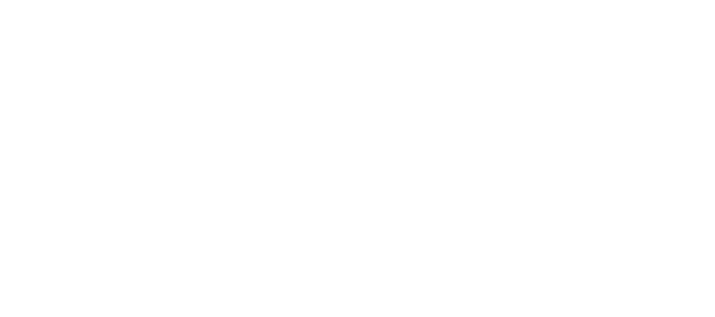
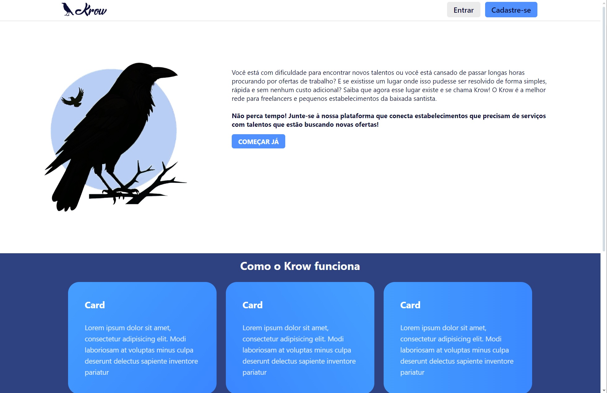
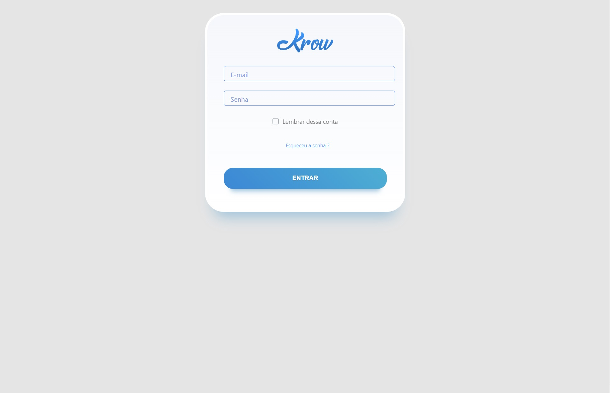
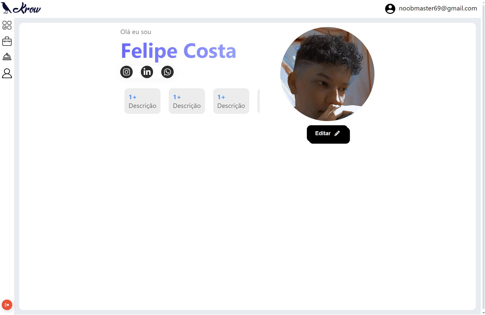
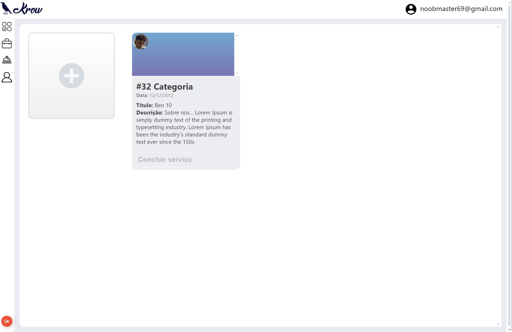
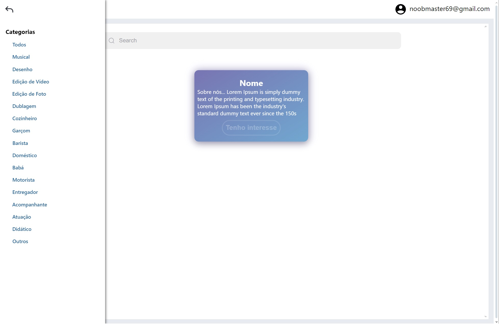

# projeto-ods-a3
 Projeto ODS da ONU para a faculdade São Judas Campus Unimonte (CSJT)
[clique aqui para abrir a plataforma online](https://felipecostamartins.github.io/projeto-ods-a3/)!

### 🌎 O que são os ODS?
  Os Objetivos de Desenvolvimento Sustentável (ODS) são 17 objetivos ambiciosos e interligados e 169 metas de ação global, para alcançar até o ano de 2030, que tratam dos principais desafios de desenvolvimento enfrentados pelas pessoas, no Brasil e no mundo.

#### 🎯Qual nosso objetivo?

Desenvolvemos uma plataforma chamada "Krow" para atender a ODS n° 8 (Trabalho decente e crescimento econômico: promover o crescimento econômico sustentado, inclusivo e sustentável, emprego pleno e produtivo, e trabalho decente para todos.)

Você mora em Santos-SP e já precisou procurar por alguém para cantar em uma noite no seu pequeno estabelecimento ou alguém para prestar um serviço doméstico na sua casa mas não tinha nenhuma indicação de alguém?

A plataforma visa melhorar e facilitar para pessoas comuns buscarem por outras pessoas dispostas a realizar os seus serviços demandados.

#### Index interface

#### Login interface

#### Cadastro interface

#### Perfil interface

#### Prestador interface

#### Contratante interface

### Barra de categoria dos serviços

Integrantes do grupo:
- Felipe Costa Martins - 52412779
- Adilson de Sousa santos - 52414629
- Leandro Bispo Cruz - 52410771
- Igor Farias Portela - 824135535